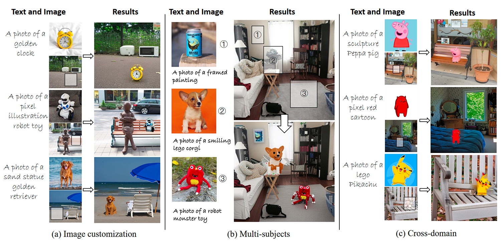
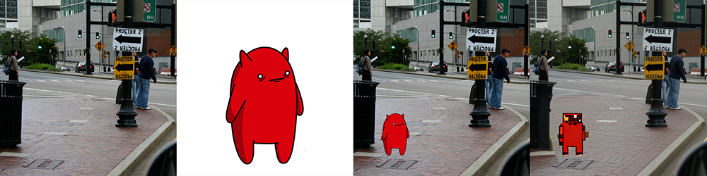
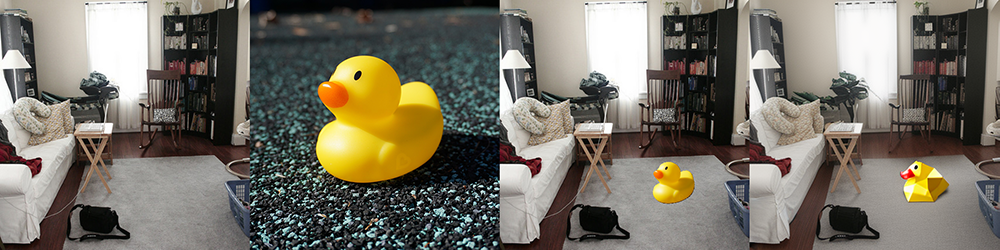
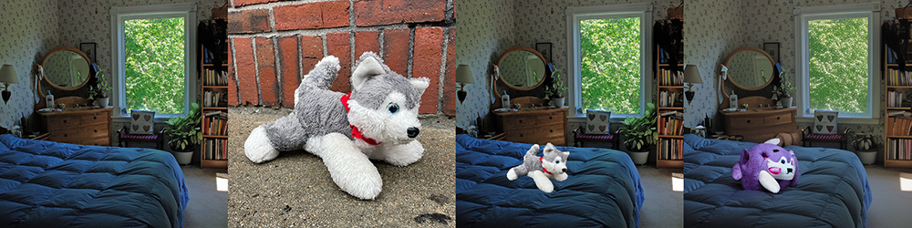
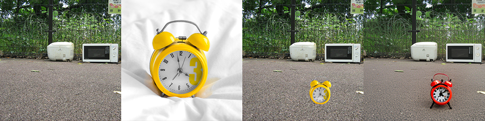
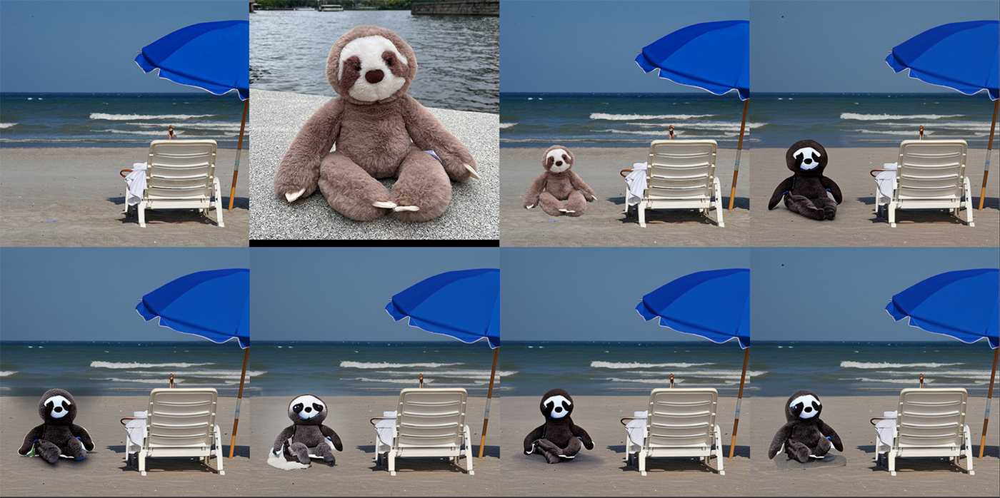

# Tuning-Free Image Customization with Image and Text Guidance

[](https://arxiv.org/abs/2403.12658)
[](https://zrealli.github.io/TIGIC)


<div>
    <h4 align="center">
        
    </h4>
</div>

This repository contains the official implementation of the following paper:
> **Tuning-Free Image Customization with Image and Text Guidance**> <br>

<!-- > [Pengzhi Li](https://zrealli.github.io/), [Qiang Nie](), [Ying Chen](), [Xi Jiang](), [Kai Wu](), [Yuhuan Lin](), [Yong Liu](), [Jinlong Peng](), [Chengjie Wang](), [Feng Zheng]()<br> -->


## :open_book: Overview
Current image customization methods with diffusion models have limitations, such as unintended changes, reliance on either reference images or text, and time-consuming fine-tuning. We introduce a tuning-free framework **TIGIC** for text-image-guided image customization, allowing precise, region-specific edits within seconds. Our approach preserves the reference image's semantic features while modifying details based on text descriptions, using an innovative attention blending strategy in the UNet decoder. This method is applicable to image synthesis, design, and creative photography.


## :hammer: Quick Start

```
git clone https://github.com/zrealli/TIGIC.git
cd TIGIC
```
### 1. Prepare Environment
To set up our environment, please follow these instructions:
```
conda env create -f environment.yaml
conda activate TIGIC
```
Please note that our project requires 24GB of memory to run.

### 2. Download Checkpoints
Next, download the [Stable Diffusion weights](https://huggingface.co/stabilityai/stable-diffusion-2-1-base/resolve/main/v2-1_512-ema-pruned.ckpt) and put it to ./ckpt.
```
wget https://huggingface.co/stabilityai/stable-diffusion-2-1-base/resolve/main/v2-1_512-ema-pruned.ckpt
```

### 4. Inference with TIGIC
After downloading the base model, to execute user inference, use the following command:


```
python run.py --ckpt ./ckpt/v2-1_512-ema-pruned.ckpt --dpm_steps 20 --outdir ./outputs --root ./examples --scale 5 --seed 42
```
The generation results can be found in the ./outputs directory. Here we show some examples below.


## :framed_picture: Generation Results
From left to right, the images are the background, subject, collage, and the result generated by TIGIC.

'a photo of a pixel cartoon'
<div>
    <h4 align="center">
        
    </h4>
</div>
'a photo of a black sloth plushie'
<div>
    <h4 align="center">
        
    </h4>
</div>
'a photo of a polygonal illustration duck toy'
<div>
    <h4 align="center">
        
    </h4>
</div>
'a photo of a purple plushie toy'
<div>
    <h4 align="center">
        
    </h4>
</div>
'a photo of a sculpture golden retriever'
<div>
    <h4 align="center">
        
    </h4>
</div>
'a photo of a red clock'
<div>
    <h4 align="center">
        
    </h4>
</div>
Please note that if the generated results contain significant artifacts, adjust the random seed `--seed` to obtain the desired outcome. We demonstrate that different random seeds can produce varying image quality in the demo.


'a photo of a black sloth plushie'
<div>
    <h4 align="center">
        
    </h4>
</div>

Please refer to our [project page](https://tianxingwu.github.io/pages/FreeInit/) for more visual comparisons.

### 🤗 Gradio Demo
We will soon release a Gradio demo version, which will include an integrated automatic foreground subject segmentation module.

## :four_leaf_clover: Acknowledgments
This project is distributed under the MIT License. Our work builds upon the foundation laid by others. We thank the contributions of the following projects that our code is based on [TF-ICON](https://github.com/Shilin-LU/TF-ICON) and [Prompt-to-Prompt](https://github.com/google/prompt-to-prompt).

## :fountain_pen: Citation

   If you find our repo useful for your research, please consider citing our paper:

   ```bibtex
@inproceedings{li2024tuning,
    title={Tuning-Free Image Customization with Image and Text Guidance}, 
    author={Li, Pengzhi and Nie, Qiang and Chen, Ying and Jiang, Xi and Wu, Kai and Lin, Yuhuan and Liu, Yong and Peng, Jinlong and Wang, Chengjie and Zheng, Feng},
    booktitle={European Conference on Computer Vision},
    year={2024}
}

   ```

